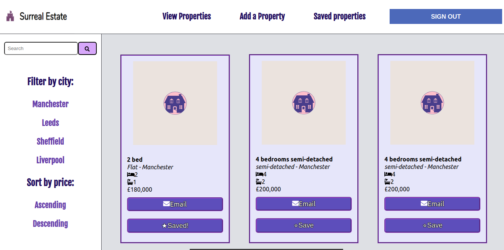
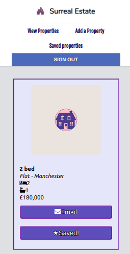

# Surreal Estate App

I was set the task of building a Surreal Estate App. 
In the app you can view properties, create a property, save a property and delete it from your saved properties.
Also you can sign up with Facebook.

## Setup

If you would like to see the code, clone my repository. To run in localhost:
- npm i
- npm start

or click the link to see the deployed app

https://surreal-estate.netlify.app/ 

    
Desktop view

    
    
Mobile view

    

## Technologies

The project was made with React using hooks.

The following packages were used:

- Axios
- PropTypes

## Testing utilities 

- Jest
- React Testing Library

## Contributing

Pull requests are welcome. For major changes, please open an issue first to discuss what you would like to change.

## Author

Created by Viktoriia Petrova as part of <a href="https://www.manchestercodes.com" target="_blank">Manchester Codes</a> learning process.
